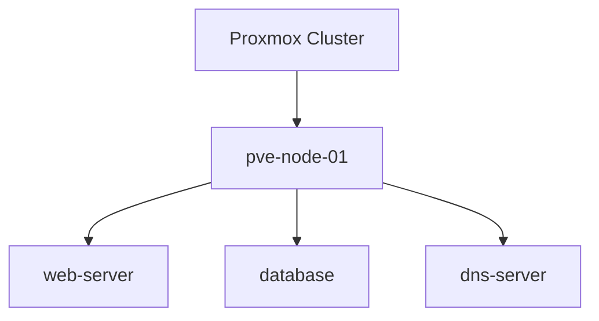

# Proxmox to Obsidian

Sync your entire Proxmox cluster into beautifully formatted Obsidian markdown pages. Generates interlinked notes with Dataview-ready frontmatter, Mermaid topology diagrams, and color-coded status callouts.

## Features

- **Full cluster sync** -- nodes, VMs, LXC containers, storage, networks, pools, backup jobs, HA groups, firewall rules, replication jobs, and recent tasks
- **Guest agent integration** -- pulls OS info and IP addresses from running VMs via QEMU guest agent
- **Dataview dashboard** -- auto-generated MOC page with live Dataview queries for all VMs, containers, and stopped guests
- **Mermaid diagrams** -- cluster and per-node topology diagrams rendered directly in Obsidian
- **Status callouts** -- color-coded Obsidian callouts (`[!success]`, `[!warning]`, `[!danger]`) based on resource status
- **Rich frontmatter** -- `ip_address`, `os_type`, `cpu_cores`, `memory_mb`, `status`, and more for powerful Dataview tables
- **Wikilink cross-references** -- VMs link to their node, storage links to nodes, pools link to members
- **Changelog tracking** -- detects added/changed/removed pages each sync
- **Stale page cleanup** -- optionally removes notes for resources that no longer exist
- **Multiple clusters** -- sync several Proxmox clusters into one vault
- **Custom templates** -- override any built-in template with your own Jinja2 files
- **Dry-run mode** -- preview what would change without writing files
- **Scheduled sync** -- includes a macOS launchd plist for automatic syncing

## Quick Start

```bash
# Clone the repo
git clone https://github.com/tylwright/proxmox-to-obsidian.git
cd proxmox-to-obsidian

# Set up a virtual environment
python3 -m venv venv
source venv/bin/activate

# Install dependencies
pip install -r requirements.txt

# Configure
cp config.yaml.example config.yaml
# Edit config.yaml with your Proxmox host, credentials, and Obsidian vault path

# Run
python proxmox_to_obsidian.py
```

## Configuration

### Single Cluster

The simplest configuration uses the `proxmox:` key:

```yaml
proxmox:
  host: "192.168.1.100"
  port: 8006
  verify_ssl: false
  auth_method: "token"
  user: "root@pam"
  token_name: "obsidian"
  token_value: "a1b2c3d4-e5f6-7890-abcd-ef1234567890"

obsidian:
  vault_path: "/home/user/ObsidianVault"
  base_folder: "Infrastructure/Proxmox"
```

### Multiple Clusters

Use the `clusters:` list to sync from several Proxmox instances:

```yaml
clusters:
  - name: "production"
    host: "pve-prod.example.com"
    port: 8006
    verify_ssl: true
    auth_method: "token"
    user: "monitoring@pve"
    token_name: "obsidian"
    token_value: "a1b2c3d4-e5f6-7890-abcd-ef1234567890"

  - name: "lab"
    host: "pve-lab.local"
    port: 8006
    verify_ssl: false
    auth_method: "password"
    user: "root@pam"
    password: "your-password"

obsidian:
  vault_path: "/home/user/ObsidianVault"
  base_folder: "Infrastructure/Proxmox"
```

When multiple clusters are configured, each gets its own subfolder:

```
Proxmox/
  production/
    Dashboard.md
    Cluster/
    Nodes/
    VMs/
    ...
  lab/
    Dashboard.md
    Cluster/
    Nodes/
    VMs/
    ...
```

### Authentication

**API Token (recommended):**

1. In Proxmox, go to Datacenter > Permissions > API Tokens
2. Create a token for your user (e.g., `root@pam` with token name `obsidian`)
3. Uncheck "Privilege Separation" for full read access, or assign the `PVEAuditor` role

```yaml
auth_method: "token"
user: "root@pam"
token_name: "obsidian"
token_value: "a1b2c3d4-e5f6-7890-abcd-ef1234567890"
```

**Username/Password:**

```yaml
auth_method: "password"
user: "root@pam"
password: "your-password"
```

### Sync Options

Control which resource types to sync:

```yaml
sync:
  cluster: true
  nodes: true
  vms: true
  containers: true
  storage: true
  networks: true
  pools: true
  backups: true
  ha: true
  firewall: true
  replication: true
  tasks: true
  dashboard: true
```

### Advanced Options

```yaml
options:
  # Delete notes for VMs/CTs that no longer exist in Proxmox
  cleanup_stale: false

  # Use custom Jinja2 templates (overrides built-in ones)
  custom_templates_dir: "/path/to/custom_templates"

  # Suppress non-error output (useful for cron/scheduled runs)
  quiet: false
```

## CLI Usage

```bash
# Standard sync
python proxmox_to_obsidian.py

# Use a different config file
python proxmox_to_obsidian.py -c /path/to/config.yaml

# Only sync VMs
python proxmox_to_obsidian.py --only vms

# Only sync a specific cluster (multi-cluster configs)
python proxmox_to_obsidian.py --cluster production

# Preview changes without writing
python proxmox_to_obsidian.py --dry-run

# Verbose debug output
python proxmox_to_obsidian.py -v

# Silent mode (errors only)
python proxmox_to_obsidian.py -q
```

### Available `--only` Targets

| Target | Description |
| --- | --- |
| `cluster` | Cluster overview, HA groups, replication |
| `nodes` | Node status, firewall rules, topology |
| `vms` | Virtual machines with guest agent data |
| `containers` | LXC containers |
| `storage` | Storage pools and usage |
| `networks` | Network interfaces (bridges, bonds, VLANs) |
| `pools` | Resource pools and members |
| `backups` | Backup job schedules |
| `tasks` | Recent cluster task history |
| `dashboard` | Dataview dashboard page |

## Generated Vault Structure

```
Proxmox/
  Dashboard.md              # Dataview queries + Mermaid overview
  Cluster/
    Cluster Overview.md     # Status, HA, replication, topology diagram
    Recent Tasks.md         # Last 100 cluster tasks
    Changelog.md            # What changed in the last sync
  Nodes/
    pve-node-01.md          # CPU/RAM/disk, VM list, firewall, topology
    pve-node-02.md
  VMs/
    100 - web-server.md     # Config, disks, NICs, guest agent, snapshots
    101 - database.md
  Containers/
    200 - dns-server.md     # Config, mounts, NICs, snapshots
    201 - monitoring.md
  Storage/
    local-lvm.md            # Type, usage per node, capacity warnings
    nfs-backups.md
  Networks/
    pve-node-01 - vmbr0.md  # Bridge config, CIDR, active status
  Pools/
    production.md           # Pool members and storage
  Backups/
    Backup - backup-abc123.md  # Schedule, targets, compression
```

## Example Pages

### Dashboard

The dashboard includes live Dataview queries that update as you sync:

```markdown
> [!info] Cluster: production
> **Total VMs:** 12 | **Total Containers:** 35
> **CPU Cores:** 96 | **Memory:** 210.4 / 512.0 GB

## All Virtual Machines

` ``dataview
TABLE status, node, cpu_cores, memory_mb, ip_address FROM #proxmox/vm SORT vmid
` ``
```

### VM Page

Each VM gets rich frontmatter for Dataview and a status callout:

```markdown
---
tags:
  - proxmox
  - proxmox/vm
type: proxmox/vm
vmid: 100
node: "pve-node-01"
status: "running"
ip_address: "10.0.1.50"
os_type: "l26"
cpu_cores: 4
memory_mb: 8192
last_synced: "2026-03-15T12:00:00Z"
---

# web-server

> [!success] Running
> VM 100 is running on [[pve-node-01]]. Uptime: 45d 3h 12m.

## Hardware

| Property | Value |
| --- | --- |
| CPU Cores | 4 |
| Sockets | 1 |
| Memory | 8192 MB |
| OS Type | l26 |

## Guest Agent

### OS Information

| Property | Value |
| --- | --- |
| OS Name | Ubuntu |
| Version | 22.04 |
| Kernel | 5.15.0-91-generic |
| Hostname | web-server |

### Network Interfaces (Guest Agent)

| Name | IP Addresses | MAC Address |
| --- | --- | --- |
| eth0 | 10.0.1.50, fe80::1 | BC:24:11:AB:CD:EF |
```

### Container Page

```markdown
---
tags:
  - proxmox
  - proxmox/container
  - proxmox/lxc
type: proxmox/container
vmid: 200
node: "pve-node-01"
status: "running"
ip_address: "10.0.1.100"
cpu_cores: 2
memory_mb: 1024
last_synced: "2026-03-15T12:00:00Z"
---

# dns-server

> [!success] Running
> Container 200 is running on [[pve-node-01]]. Uptime: 90d 12h 5m.

## Network Interfaces

| Device | Bridge | IP | Gateway | HWADDR |
| --- | --- | --- | --- | --- |
| net0 (eth0) | vmbr0 | 10.0.1.100/24 | 10.0.1.1 | BC:24:11:12:34:56 |
```

### Cluster Topology (Mermaid)

The cluster page and dashboard include auto-generated Mermaid diagrams:



### Storage with Capacity Warning

```markdown
> [!danger] Storage Critical
> Usage exceeds 90% on node(s): pve-node-02.

## Usage by Node

| Node | Used | Total | Usage % |
| --- | --- | --- | --- |
| [[pve-node-01]] | 180.5 GB | 500.0 GB | 36.1% |
| [[pve-node-02]] | 465.2 GB | 500.0 GB | 93.0% |
```

### Changelog

After each sync, a changelog is generated showing what changed:

```markdown
## Added
- **VMs** - [[103 - new-service]]: File added

## Changed
- **Containers** - [[200 - dns-server]]: File changed

## Removed
- **VMs** - 99 - decommissioned: Resource no longer exists in Proxmox
```

## Dataview Examples

With the [Dataview plugin](https://github.com/blacksmithgu/obsidian-dataview) installed, you can create powerful queries across your Proxmox data.

**All running VMs sorted by memory:**

```dataview
TABLE node, cpu_cores, memory_mb, ip_address
FROM #proxmox/vm
WHERE status = "running"
SORT memory_mb DESC
```

**Containers on a specific node:**

```dataview
TABLE status, cpu_cores, memory_mb
FROM #proxmox/container
WHERE node = "pve-node-01"
SORT vmid
```

**All stopped resources:**

```dataview
TABLE type, node
FROM #proxmox
WHERE status = "stopped"
SORT file.name
```

**Storage usage overview:**

```dataview
TABLE storage_type, storage_name
FROM #proxmox/storage
SORT file.name
```

## Custom Templates

To override any built-in template, create a `custom_templates/` directory and add your modified `.j2` files:

```bash
mkdir custom_templates
cp templates/vm.md.j2 custom_templates/vm.md.j2
# Edit custom_templates/vm.md.j2 to your liking
```

Then set the path in your config:

```yaml
options:
  custom_templates_dir: "./custom_templates"
```

Custom templates take priority over built-in ones. Any template not found in the custom directory falls back to the built-in version.

## Scheduled Sync (macOS)

A launchd plist is included for automatic syncing every 30 minutes:

```bash
# Edit the plist to match your paths
vim com.grid.proxmox-to-obsidian.plist

# Install
cp com.grid.proxmox-to-obsidian.plist ~/Library/LaunchAgents/

# Load (starts immediately and runs every 30 min)
launchctl load ~/Library/LaunchAgents/com.grid.proxmox-to-obsidian.plist

# Check status
launchctl list | grep proxmox-to-obsidian

# Unload
launchctl unload ~/Library/LaunchAgents/com.grid.proxmox-to-obsidian.plist
```

Logs are written to `/tmp/proxmox-to-obsidian.stdout.log` and `/tmp/proxmox-to-obsidian.stderr.log`.

### Cron (Linux)

```bash
# Run every 30 minutes
*/30 * * * * cd /path/to/proxmox-to-obsidian && /path/to/venv/bin/python proxmox_to_obsidian.py -q
```

## Requirements

- Python 3.10+
- Proxmox VE 7.x or 8.x
- [Obsidian](https://obsidian.md/) with [Dataview plugin](https://github.com/blacksmithgu/obsidian-dataview) (optional, for dashboard queries)

### Python Dependencies

| Package | Purpose |
| --- | --- |
| `proxmoxer` | Proxmox API client |
| `requests` | HTTP backend for proxmoxer |
| `PyYAML` | Configuration file parsing |
| `Jinja2` | Markdown template rendering |

## License

MIT
